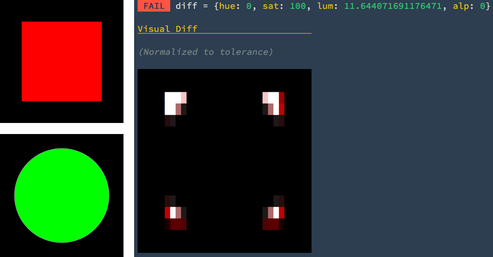
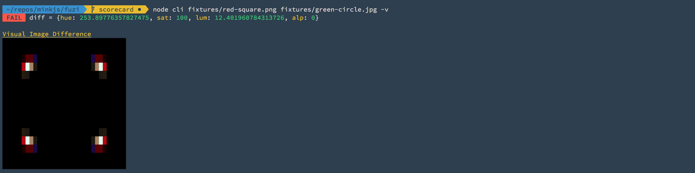
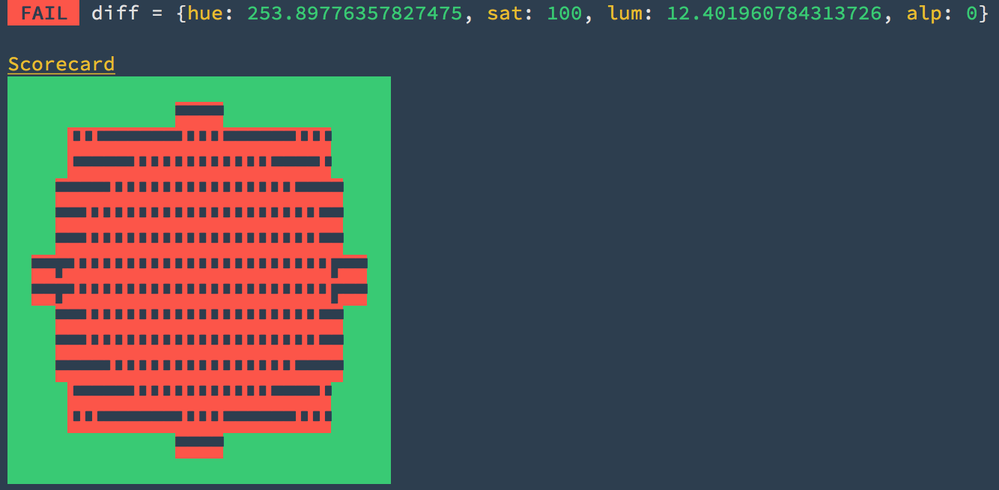
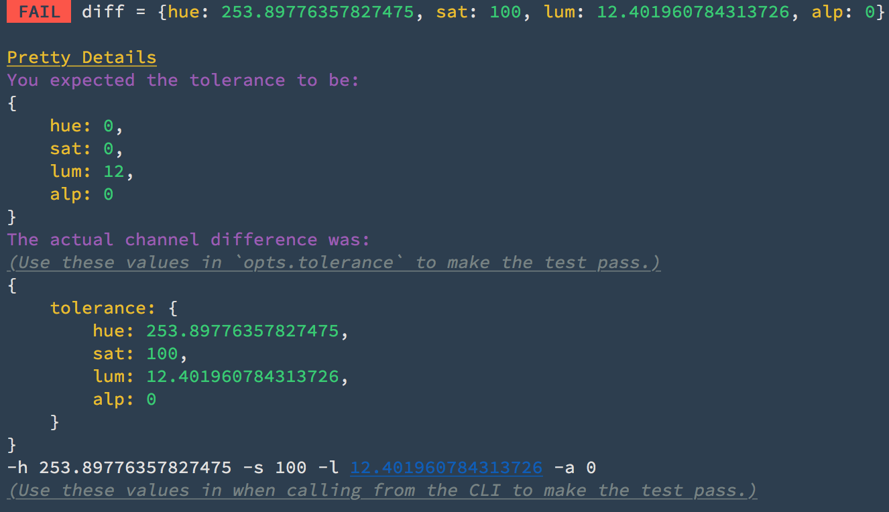
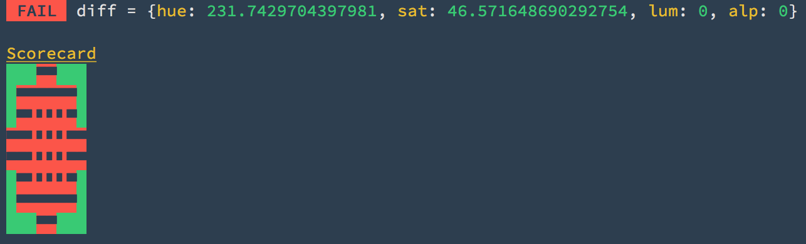
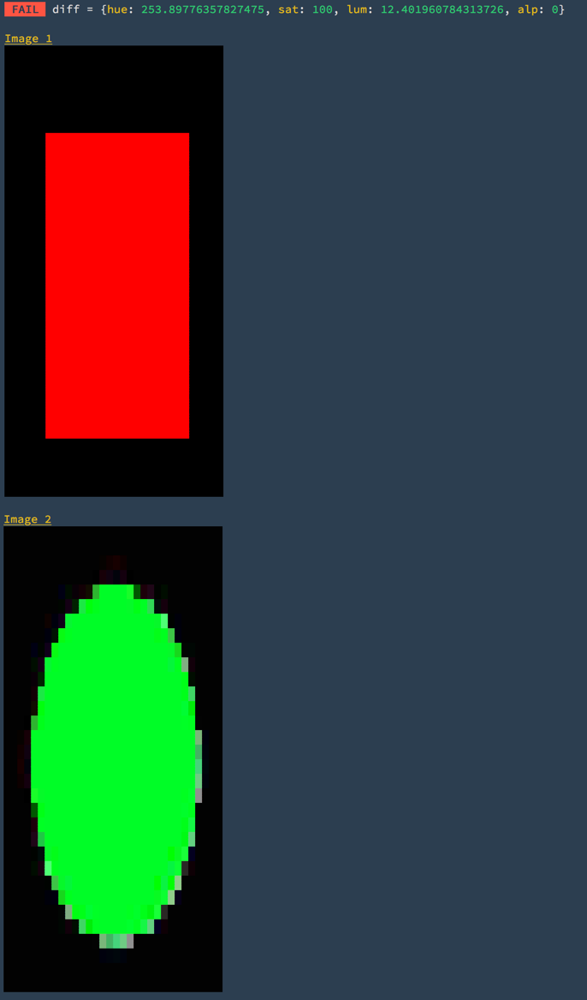
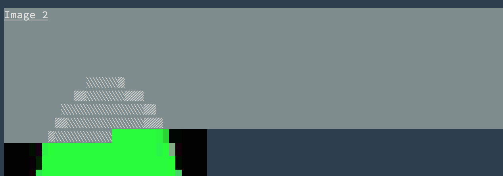
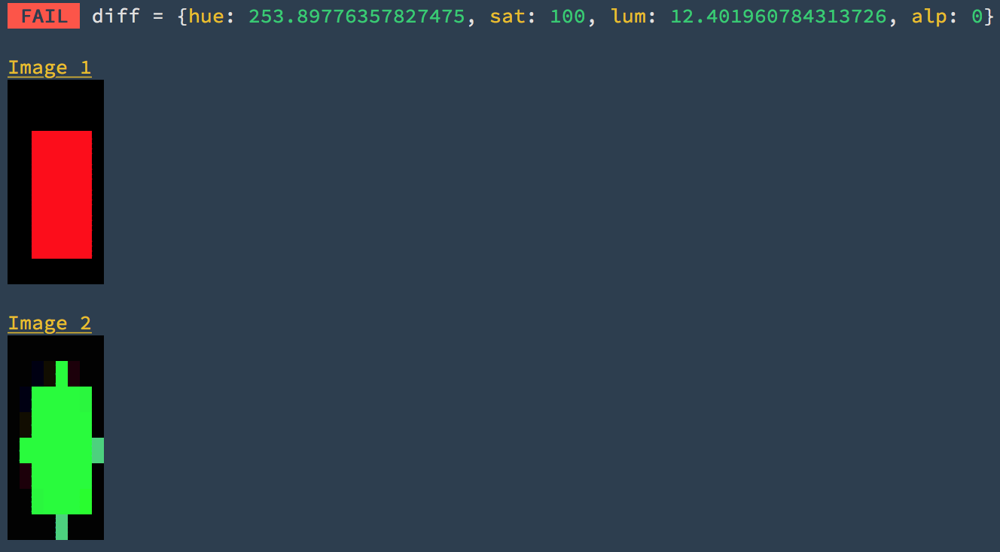

# Fuzi!

> 🐻  fuzzy image diff'ing for the terminal

[](https://travis-ci.org/F1LT3R/fuzi)
[](https://coveralls.io/github/F1LT3R/fuzi?branch=master)
[](https://www.npmjs.com/package/fuzi)
[](https://github.com/sindresorhus/xo)

## Support

Support the development of Fuzi by [becoming a patreon](https://patreon.com/bePatron?u=9720216).

<a href="https://patreon.com/bePatron?u=9720216"></a>

## Example

Fuzi is an image diffing tool for Ref-Testing in your facorite CI environment, (Travis, Circle, etc). Fuzi outputs graphics to your terminal using ANSI color codes, making it quicker to understand why a test is failing from the logs of your remote server.

Need to check the difference between two images? Ask Fuzi! 🐻

```shell
$ fuzi red-square.png green-circle.jpg -v
```



To run this as a Node API:

```js
const fuzi = require('fuzi');

(async () => {
	const img1 = 'fixtures/red-square.png';
	const img2 = 'fixtures/green-circle.png';
	const result = await fuzi(img1, img2);
	console.log(result.pass);  // false
})
```

## Features

- **CLI Mode** - Diff images from the CLI
- **API Mode** - Diff from Node in your favorite test framework
- **Unequal Images**
	+ Size can be different
	+ Dimensions can be different
	+ File type can be different
- **File-types:**
	+ PNG
	+ JPG
- **Easy Pass** - "pass settings" provided on every fail
- **User Configurable** - tweak settings to your tests

## Installation

For global use:

```shell
$ npm i -g fuzi
$ yarn --global add fuzi
```

For local testing:

```shell
$ npm i --save-dev fuzi
$ yarn add fuzi
```

# CLI Usage

It is recommended that you familiarize yourself with Fuzi in the CLI first. This will make writing tests much easier.

## Visual Diff

View the visual diff between the two images. The visual diff is normalized to the maximum difference in each channel. This means the visual diff does not represent the actual pixel difference, but allows small differences to always be visible.

```shell
fuzi fixtures/red-square.png fixtures/green-circle.jpg -v
```


## Scorecard

- **Flag:** `-d`
- **Type:** `boolean`

The scorecard represents each rectangle in the visual grid. Red squares represent failures. Green squares represent passes. In this example, the luminance channel tolerance is being set high enough to show where the two images are most similar.

```shell
fuzi fixtures/red-square.png fixtures/green-circle.jpg -d -l 12
```



Within each red square you will see dark blocks. These dark blocks represent the channels that were different. This helps to provide channel difference information at a glance.

For example:

```plaintext
H = ▘
S = ▝
L = ▖
A = ▗
HSLA = █
HSL = ▛
```

Note: The scorecard will always be the same width as your grid.

## Pretty Details

- **Flag: `-p`**
- **Type: `boolean`**

Pretty Details prints out the your expected tolerance and the actual tolerance. To help make testing easier, Pretty Details prints settings that will make your failing test pass, in the form of:

1. JavaScript object tollerance settings
1. CLI flags tolerance settings

```shell
fuzi fixtures/red-square.png fixtures/green-circle.jpg -l 12 -p
```



## Grid Size

- **Flags:** `-c <columns>`, `-r <rows>`
- **Type:** `number`

By default Fuzi uses a `32 x 16` grid size. Changing the grid size does not change the overall performance. Every pixel in each image is counted.

```shell
fuzi fixtures/red-square.png fixtures/green-circle.jpg -d -l 12 -c 8 -r 8
```



## Channel Tollerances

- **Flags:**
	+ `-h <hue>`
	+ `-s <saturation>`
	+ `-l <luminance>`
	+ `-a <alpha>`
- **Type:** `number`

You can provide the tolerances thresholds that you would like to test for each channel. If Fuzi finds no grid squares that are greater than the tolerance thresholds you set, then the test will pass.

```shell
fuzi -h 254 -s 100 -l 13 -a 0 fixtures/red-square.png fixtures/green-circle.jpg
```


## Displaying Source Images

- **Flag:**`-i <images:columns>`
- **Type:** `boolean|number`

Fuzi can output the source images you are diffing as ANSI graphics. This can help you see what your images look like in CI, without sending image data to another server.

To display the source images that you are diffing, use the `-i` flag. The default image width is 32 characters wide.

```shell
fuzi fixtures/red-square.png fixtures/green-circle.jpg -i
```



Note that when you select the image, it is made up of gradient block characters, making it visible in clients without good color support.



To set the width of the display images manually, you can add a number to the `-i` flag, for example:

```shell
fuzi fixtures/red-square.png fixtures/green-circle.jpg -i 8
```



## Everything

- **Flag:**`-e <everything>`
- **Type:** `boolean`

To display everything use the `-e` flag.

```shell
fuzi fixtures/red-square.png fixtures/green-circle.jpg -e
```

This will output all of the above graphic reporters listed for the CLI.

# API Usage

## All Options

Here is are the options and their default values together:

```
const opts = {
	// The grid shape for your comparison
	grid: {
		columns: 32,
		rows: 16
	},

	// The maximum different you expect to find
	// in each channel between the two images
	tolerance: {
		hue: 0,
		sat: 0,
		lum: 0,
		alp: 0
	},

	display: {
		// Display the PASS/FAIL result alongside
		// the actual differences between the two
		// images, (for each HSLA channel)
		result: false,

		// Pretty-Print the results, with extra 
		// details for CLI usage
		Pretty: false
		
		// Output your source images to the 
		// CLI with ANSI color codes
		images: false,

		// Set the character width of the 
		// images output to the CLI
		imageWidth: 32,
		
		// Show the scorecard (debug your results)
		scorecard: false,

		// Show the visual difference between the 
		// two images as color ANSI output
		// (debug your results)
		visualDiff: false,
	}
}
```

# How does Fuzi work?

## Grid

Rather than try to compare the whole image, Fuzi splits each image into a spatial grid and compares the two. This helps to evaluated which parts of the image match, and which are different.

The default grid size is 32 x 16:

```js
const opts = {
	grid: {
		columns: 32,
		rows: 16
	}
}
```

## Channels

Fuzi splits your images into 4 channels to finds the average value for each grid square. These chanels are:

- Hue
- Saturation
- Luminance
- Alpha

## Tolerance

Fuzi then takes the tolerance parameter you provide, and compares the average chanel values in each square to see if they are above or below your threshold.

The thresholds default to 0:

```js
const opts = {
	tolerance: {
		hue: 0,
		sat: 0,
		lum: 0,
		alp: 0
	}
}
```

## PASS or FAIL

If **any** grid square's average channel value is above the tolerance (for **any** channel), your images are considered to be `different`.

This results in a `FAIL`.

If **all** grid squares average channel values are below your provided tolerance threshold, then your images are considered to the `alike`.

This results in a `PASS`.

