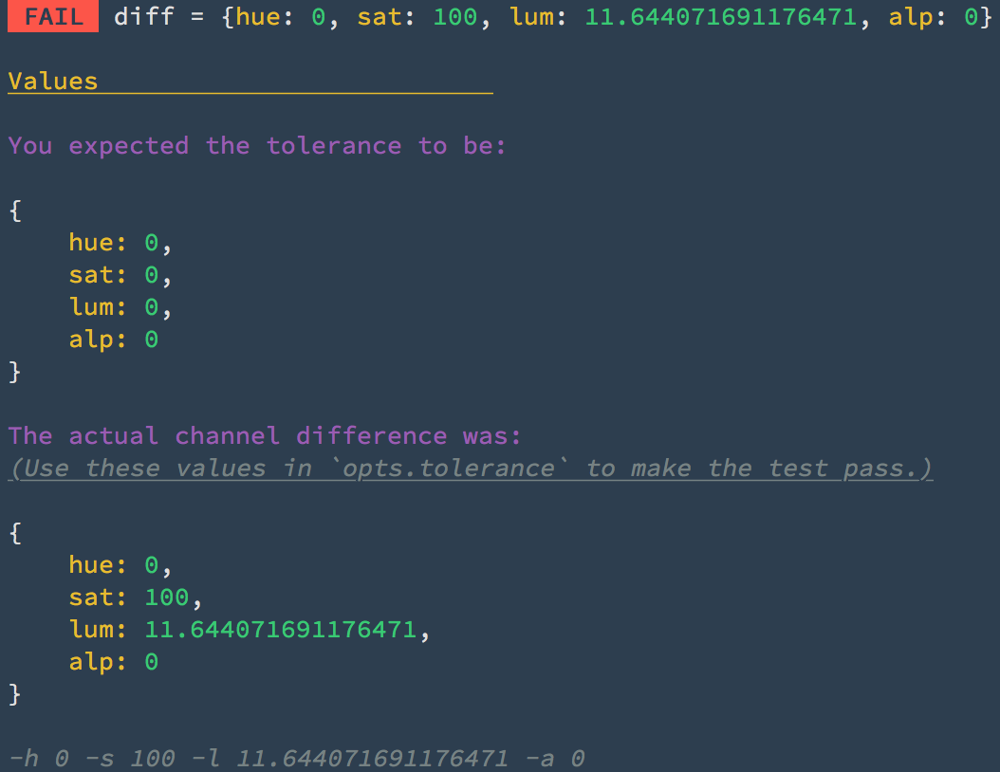

# 🚧  Alpha Version (Work in Progress)

API subject to change

---

# Fuzi!

> 🐻  fuzzy image diff'ing for the terminal

[](https://travis-ci.org/F1LT3R/fuzi)
[](https://coveralls.io/github/F1LT3R/fuzi?branch=master)
[](https://www.npmjs.com/package/fuzi)
[](https://github.com/sindresorhus/xo)

## Example

Need to check the difference between two images? Ask Fuzi! 🐻

```shell
$ fuzi red-square.png green-circle.jpg -v
```


## Features

- Diff images from the CLI
- Diff in API Mode for use in test frameworks
- Images do not have to match
	+ Size can be different
	+ Dimensions can be different
	+ File type can be different
- Supports file-types: PNG, JPG
- Configurable settings for tweaking each tests


## About

Fuzi is an image diffing tool for Ref-Testing in a CI environment, (Travis, Circle, etc). Fuzi outputs graphics to your terminal, making it quicker to understand why a test is failing. 

### CLI plus API
	
Fuzi can diff in the CLI so that you can experiment and get used to it's inputs and outputs. Fuzi diff as a Node API to use in your testing framework.

### Call it a "PASS"

When your tests fail in the cloud, Fuzi gives you the tolerance settings required to make the test pass the next time it runs. Phew!



## Installation

For global use:

```shell
$ npm i -g fuzi
$ yarn --global add fuzi
```

For local testing:

```shell
$ npm i --save-dev fuzi
$ yarn add fuzi
```

## How does Fuzi work?

### Grid

Rather than try to compare the whole image, Fuzi splits each image into a spatial grid and compares the two. This helps to evaluated which parts of the image match, and which are different.

### Channels

Fuzi splits your images into 4 channels to finds the average value for each grid square. These chanels are:

- Hue
- Saturation
- Luminance
- Alpha

### Tolerance

Fuzi then takes the tolerance parameter you provide, and compares the average chanel values in each square to see if they are above or below your threshold.

The thresholds default to 0:

```js
const opts = {
	tolerance: {
		hue: 0,
		sat: 0,
		lum: 0,
		alp: 0
	}
}
```

### PASS or FAIL

If **any** grid square's average channel value is above the tolerance (for **any** channel), your images are considered to be `different`.

This results in a `FAIL`.

If **all** grid squares average channel values are below your provided tolerance threshold, then your images are considered to the `alike`.

## Using Fuzi with your Test Framework

```js
import test from 'ava'
import fuzi from 'fuzi'

test('Different images fail', async t => {
	const img1 = 'fixtures/green-circle.png'
	const img2 = 'fixtures/red-square.png'

	const opts = {
		grid: {
			columns: 8,
			rows: 8
		},
		tolerance: {
			hue: 0,
			sat: 0,
			lum: 0,
			alp: 0
		}
	}

	const result = await fuzi(img1, img2, opts)
	t.true(result.fail)
})
```

```js
import test from 'ava'
import fuzi from 'fuzi'

test('Identical images pass', async t => {
	const img1 = 'fixtures/green-circle.png'
	const img2 = 'fixtures/green-circle.png'
	const opts = {
		grid: {
			columns: 8,
			rows: 8
		},
		tolerance: {
			hue: 0,
			sat: 0,
			lum: 0,
			alp: 0
		}
	}
	const result = await fuzi(img1, img2, opts)
	t.true(result.pass)
})
```


