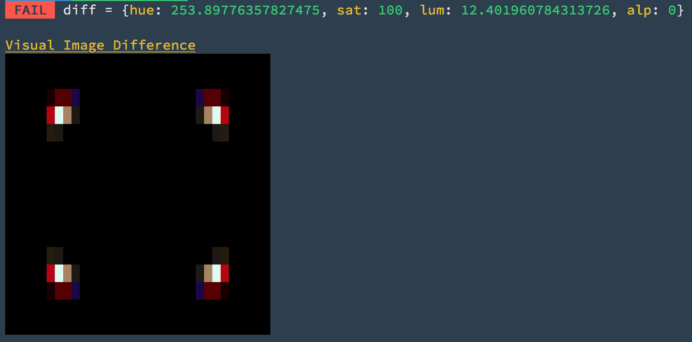

# Fuzi!

> 🐻  fuzzy image diff'ing for the terminal

[](https://travis-ci.org/F1LT3R/fuzi)
[](https://coveralls.io/github/F1LT3R/fuzi?branch=master)
[](https://www.npmjs.com/package/fuzi)
[](https://github.com/sindresorhus/xo)

## Support

Support the development of Fuzi by [becoming a patreon](https://patreon.com/bePatron?u=9720216).

<a href="https://patreon.com/bePatron?u=9720216"></a>

## Example

Fuzi is an image diffing tool for Ref-Testing in your facorite CI environment, (Travis, Circle, etc). Fuzi outputs graphics to your terminal using ANSI color codes, making it quicker to understand why a test is failing from the logs of your remote server.

Need to check the difference between two images? Ask Fuzi! 🐻

```shell
$ fuzi red-square.png green-circle.jpg -v
```


To run this as a Node API:

```js
const fuzi = require('fuzi');

(async () => {
	const img1 = 'fixtures/red-square.png';
	const img2 = 'fixtures/green-circle.png';
	const result = await fuzi(img1, img2);
	console.log(result.pass);  // false
})
```

## Features

- Diff images from the CLI
- Diff in API Mode for use in test frameworks
- Images do not have to match
	+ Size can be different
	+ Dimensions can be different
	+ File type can be different
- Supports file-types: PNG, JPG
- Configurable settings for tweaking each test

### CLI and API Modes Available
	
- Fuzi can diff in the CLI so that you can experiment, and get used to it's settings and results.
- Fuzi can diff as a Node API for use in your favorite testing framework.

I like to use [AVA: The Futurisic Test Runner](https://github.com/avajs/ava).

### Make Passing Easy

When your tests fail in the cloud, Fuzi can give you the tolerance settings you need to make the test pass the next time you runs. Phew!


## Installation

For global use:

```shell
$ npm i -g fuzi
$ yarn --global add fuzi
```

For local testing:

```shell
$ npm i --save-dev fuzi
$ yarn add fuzi
```

# CLI Usage

## Visual Diff

```shell
node cli fixtures/red-square.png fixtures/green-circle.jpg -v
```



## All Options

Here is are the options and their default values together:

```
const opts = {
	// The grid shape for your comparison
	grid: {
		columns: 32,
		rows: 16
	},

	// The maximum different you expect to find
	// in each channel between the two images
	tolerance: {
		hue: 0,
		sat: 0,
		lum: 0,
		alp: 0
	},

	display: {
		// Display the PASS/FAIL result alongside
		// the actual differences between the two
		// images, (for each HSLA channel)
		result: false,

		// Pretty-Print the results, with extra 
		// details for CLI usage
		Pretty: false
		
		// Output your source images to the 
		// CLI with ANSI color codes
		images: false,

		// Set the character width of the 
		// images output to the CLI
		imageWidth: 32,
		
		// Show the scorecard (debug your results)
		scorecard: false,

		// Show the visual difference between the 
		// two images as color ANSI output
		// (debug your results)
		visualDiff: false,
	}
}
```

# How does Fuzi work?

## Grid

Rather than try to compare the whole image, Fuzi splits each image into a spatial grid and compares the two. This helps to evaluated which parts of the image match, and which are different.

The default grid size is 32 x 16:

```js
const opts = {
	grid: {
		columns: 32,
		rows: 16
	}
}
```

## Channels

Fuzi splits your images into 4 channels to finds the average value for each grid square. These chanels are:

- Hue
- Saturation
- Luminance
- Alpha

## Tolerance

Fuzi then takes the tolerance parameter you provide, and compares the average chanel values in each square to see if they are above or below your threshold.

The thresholds default to 0:

```js
const opts = {
	tolerance: {
		hue: 0,
		sat: 0,
		lum: 0,
		alp: 0
	}
}
```

## PASS or FAIL

If **any** grid square's average channel value is above the tolerance (for **any** channel), your images are considered to be `different`.

This results in a `FAIL`.

If **all** grid squares average channel values are below your provided tolerance threshold, then your images are considered to the `alike`.

This results in a `PASS`.

